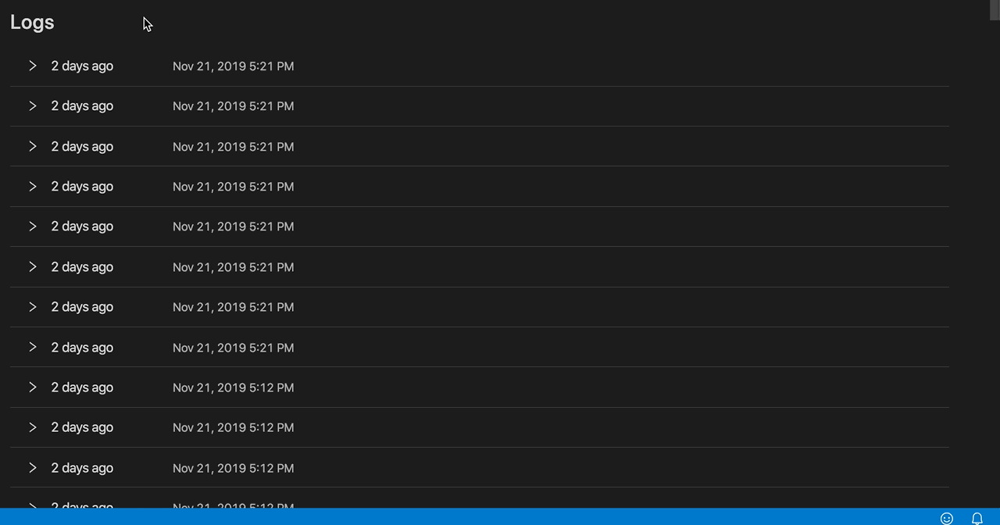

# Serverless Console

Serverless Console enables you to show function overview and logs from within the Visual Studio Code editor.


**Note: it works only for AWS at the moment**

## Features

- Log groups are grouped per project and correspond to a single Serverless service (even though it's also possible to use it without serverless framework)
- Stages are shown per function on its own tab
- Times are shown relative to current timestamp (like "2 minutes ago")
- Logs can be grouped per request
- Log stream can be searched




## Extension Settings

This extension contributes the following settings:

- `serverlessConsole.groupPerRequest`: determines a default option on whether logs should be grouped per request.
- `serverlessConsole.services`: a list of services from which data is retrieved.

By default, "serverlessFramework" type is used.

It works by executing `serverless print` command and then extracting functions defined in `serverless.yml`:

```json
{
  "serverlessConsole.services": [
    {
      "type": "serverlessFramework",
      "awsProfile": "default",
      "cwd": "./",
      "command": "sls print",
      "timeOffsetInMs": 0,
      "stages": ["dev"]
    }
  ]
}
```

If you are not using the serverless framework, or want to add custom **CloudWatch logs** in addition to it, you can define them using `custom` type:

```json
{
  "serverlessConsole.services": [
    {
      "type": "custom",
      "awsProfile": "default",
      "timeOffsetInMs": 0,
      "title": "EC2 logs",
      "region": "us-east-1",
      "items": [
        {
          "title": "PM2 process",
          "description": "optional desc",
          "tabs": [
            {
              "title": "dev",
              "logs": "custom_log_group"
            },
            {
              "title": "prod",
              "logs": "custom_log_group2",
              "lambda": "custom_function"
            }
          ]
        }
      ]
    }
  ]
}
```

# Credits
Icon made by [turkkub](https://www.flaticon.com/authors/turkkub) from [www.flaticon.com](http://www.flaticon.com/)