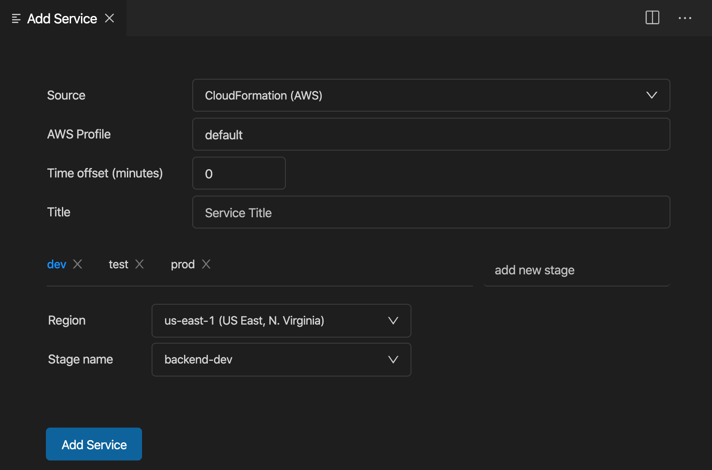

# Serverless Console

Serverless Console enables you to show function overview and logs from within the Visual Studio Code editor.

**Note: it works only for AWS at the moment**

## Features

- Log groups are grouped per project and correspond to a single Serverless service (even though it's also possible to use it without serverless framework)
- Stages are shown per function on its own tab
- Times are shown relative to current timestamp (like "2 minutes ago")
- Logs can be grouped per request
- Log stream can be searched

## Support for Serverless Framework or CloudFormation

Data for serverless functions can be retrieved by parsing `serverless.yml` definition or from a CloudFormation stack (especially useful if you are using **AWS SAM**).

## Extension Settings

This extension contributes the following settings:

- `serverlessConsole.groupPerRequest`: determines a default option on whether logs should be grouped per request.
- `serverlessConsole.services`: a list of services from which data is retrieved.

# Credits

Icon made by [turkkub](https://www.flaticon.com/authors/turkkub) from [www.flaticon.com](http://www.flaticon.com/)
